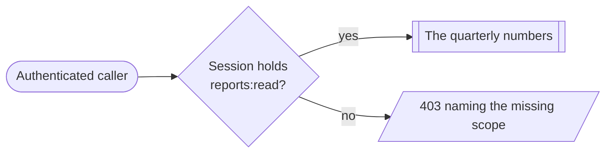

# Read a report

The narrowest useful slice in the harness: one function, one declared scope, two
callers on opposite sides of it. Its whole job is to make a scope gate
_observable_ — a passing call and a refused call, both authenticated, differing
only in what the session resolves.

The refusal has to name the missing scope. A 403 that says only "forbidden"
cannot be told apart from a bug in the caller, which is the failure this slice
exists to rule out.



[getReport](func:getReport) is the only function behind the gate, and
[reports:read](scope:reports:read) the only scope in front of it.

```gherkin
Scenario: The holder reads the report
  Given 'guest' holds the report-viewer role
  When 'guest' calls getReport
  Then 'guest' sees the quarterly numbers

Scenario: An authenticated caller without the scope is refused
  Given 'admin' holds the umbrella admin scope and not reports:read
  When 'admin' calls getReport
  Then 'admin' is refused with a 403 naming the missing scope
```

Scopes narrow and never widen, so the admin's umbrella scope does not help here —
see [only report-viewers read a report](../decisions/security/only-report-viewers-read-a-report.md).
