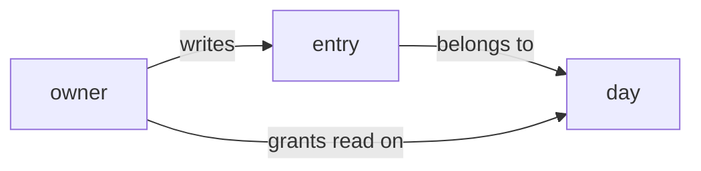

# Pikku Knowledge

The knowledge base is `knowledge/` at the repo root: markdown notes about **what the app is**, written for whoever picks the project up next — human or agent.

Not to be confused with `.knowledge/` — the dot-prefixed JSON blueprint that `pikku-software-archaeology` extracts from a legacy repo. Different directory, different format, different purpose.

## Agent Operating Procedure

1. **Read `knowledge/index.md` first**, then the section index for whatever you are about to touch. It is the cheapest way to learn what the app already claims about itself.
2. Before writing a note, ask whether `pikku meta` already answers it. If it does, do not write the note — see _What never goes in a note_.
3. Write the note in the section that answers its question. Create the section's `index.md` in the same turn you create the section.
4. Add a `resource:` only if you can name a real id. A wrong one is worse than none.
5. Run `pikku knowledge validate`. Fix what it reports.
6. Run `pikku knowledge index` so each section lists what is actually in it.

## The governing rule

**Record only what pikku cannot tell you.**

Pikku already knows every function, route, schema, table, column, queue, cron, channel and permission — `pikku meta` prints them, and the generated meta is the truth. A note that lists tables or routes is a copy that starts drifting the moment somebody edits the code, and it drifts _while looking authoritative_, which is worse than silence.

What a note is for is the part no generator can derive: what a thing means, why a rule was chosen, what it rules out, who asked for it, and what is still unanswered.

## The note

A note is a markdown file whose **path is its identity** — moving it renames it. It carries YAML frontmatter and a body:

```markdown
---
type: decision
title: Revocation ends a grant
description: A revoked grant stops working immediately, everywhere.
resource: func:revokeGrant, table:grant
tags: [sharing, access]
---

# Revocation ends a grant

When an owner revokes a grant, the person loses access on their next request — no
grace period and no scheduled cleanup.

This rules out a "revoked but valid until midnight" state, which we considered
for shared days and rejected: two people disagreeing about who can see today is
worse than one of them losing access mid-session.
```

Frontmatter fields:

| Field         | Meaning                                                                                                                 |
| ------------- | ----------------------------------------------------------------------------------------------------------------------- |
| `type`        | **The only required field.** `slice` — or `milestone`, when the project's own `knowledge/index.md` names the section that way; `validate` accepts both, so follow the scaffold rather than this list. Then `entity`, `decision`, `note`, `overview`. Lowercase — gates compare it literally. |
| `title`       | What to call the note in a listing. Falls back to the first heading, then the filename.                                 |
| `description` | One line, used as the note's subtitle in a section index.                                                               |
| `resource`    | Comma-separated `<kind>:<id>` URIs — the code this note is about. See below.                                            |
| `tags`        | Flow list (`[a, b]`) or a `- item` block; both are read.                                                                |
| `timestamp`   | When it was written, if it matters.                                                                                     |

`index.md` and `log.md` are **reserved**: an `index.md` maps a directory, a `log.md` is an append-only record. Neither is ever listed as a note by an index.

Plain markdown links between notes — `[revocation](../decisions/revocation-ends-a-grant.md)` — are what make the base a graph. A link to a note that does not exist yet is legal: it marks something worth writing, not an error.

## The layout

```
knowledge/
  index.md                                  # type: overview — the map
  slices/
    index.md
    01-the-daily-entry.md                   # type: slice
  entities/
    index.md
    entry.md                                # type: entity
  decisions/
    index.md
    revocation-ends-a-grant.md              # type: decision
    security/
      index.md
      one-account-one-person.md
  questions/
    index.md
    who-owns-a-shared-day.md                # type: note
  wishlist/
    index.md
    export-to-a-calendar.md                 # type: note
```

Each section answers exactly one question, which is what lets a reader find a note without an index of indexes:

| Section               | The question it answers                                            |
| --------------------- | ------------------------------------------------------------------ |
| `slices/`             | What is one buildable piece of this app, and what proves it works? |
| `entities/`           | What is this thing, in the words users use for it?                 |
| `decisions/`          | What was chosen, and what does that rule out?                      |
| `decisions/security/` | Who may do what?                                                   |
| `questions/`          | What has been asked and not yet answered?                          |
| `wishlist/`           | What does somebody want that nobody has asked to be built?         |

**Create a section the turn you have a note for it** — never a scaffold of empty directories, and never a section without its own `index.md`. A section index says in one line what belongs in it; that sentence is the reason the file exists, so `pikku knowledge index` writes only the note listing and leaves your prose alone.

## Slices

A slice is the one note type that is a piece of _work_ rather than a fact, so it alone carries state and size:

````markdown
---
type: slice
title: The daily entry
description: An owner writes one entry per day, and sees it on the day.
status: proposed
entities: entry, day
resource: func:createEntry
---

# The daily entry

An owner writes at most one entry per day. Writing again replaces it.

```gherkin
Given 'owner' has no entry for today
When 'owner' writes one
Then it appears on today's day
And writing again replaces it rather than adding a second
```
````

- **`status`** is `proposed` → `dispatched` → `built`. Nothing else. Every gate compares it literally.
- **`entities`** lists what the slice touches, **at most three**. Past three it is not one buildable piece — split it.
- **The scenario is a fenced `gherkin` block, in the third person.** `Given 'owner' has no entry` — never `Given I have no entry`. A quoted word _means a persona_, which is what lets a reader (and a test) tell who is acting. First person hides that, so it is rejected. The console draws the keywords as a column and each quoted persona as a chip, so a first-person scenario is visibly a block with no personas in it.

## Showing it

A note is markdown, and four kinds of block are **drawn** rather than printed. Every one of them degrades to something readable — a diagram falls back to its source, a callout to a blockquote, a decision to a code block — so writing one costs nothing where it is not rendered.

None of this changes the governing rule. A diagram of the schema is still a copy of `pikku meta` that drifts, and it drifts while looking more authoritative than prose would. These are for the part no generator can derive.

**```mermaid — when the relationship is the point.** Prose is bad at graphs: "an entry belongs to a day, a day belongs to an owner, and a grant lets another owner read a day" is a sentence a reader has to re-read twice and draw themselves. Reach for one when a note is about how several things relate, an order of steps across time, or a state machine. Do not draw one thing, or two things and an arrow — that is a sentence.

````markdown

````

**`> [!NOTE]` — when a line must survive skimming.** Five kinds: `NOTE`, `TIP`, `IMPORTANT`, `WARNING`, `CAUTION`. Use one for the thing a reader who skips the paragraph must still not miss — a trap, a constraint that is easy to violate, an assumption the rest of the note rests on. Two callouts in a note is normal; six means the note has no prose left and nothing stands out.

```markdown
> [!WARNING]
> A grant is checked on every request, not cached. A permission change is
> immediate everywhere, and there is no invalidation step to forget.
```

**```decision — the answer a decision note owes.** `decisions/` answers "what was chosen, and what does that rule out?", and the second half is the half that gets dropped. The fence makes it checkable: `pikku knowledge validate` warns when a fence says what was chosen and never says what it closes off.

````markdown
```decision
chosen: A revoked grant stops working immediately, everywhere.
rules-out:
  - A "revoked but valid until midnight" state
  - A scheduled cleanup job
because: Two people disagreeing about who can see today is worse than one of
  them losing access mid-session.
```
````

It is a **summary, not the note** — the argument continues in prose underneath. `rules-out:` takes one line or a `- item` block, and any value too long for one line wraps onto indented lines under it, as `because:` does above. A decision genuinely argued in prose needs no fence, and validate never asks for one; what it does ask is that a fence you did write is complete.

**Fences of any other language are code** — highlighted and copyable, which is right for a snippet and wrong for a scenario or a decision, so do not put either in a bare fence.

## `resource:` — tying a note to the code

`resource:` names the code a note is about, as one or more `<kind>:<id>` URIs, comma-separated.

**Every kind resolves.** That is the whole design: a kind that cannot be checked lets notes accumulate references nothing validates, and the graph rots into fiction exactly where it looks most authoritative.

| Kind        | An id is                                           | Where it resolves                                                                          |
| ----------- | -------------------------------------------------- | ------------------------------------------------------------------------------------------ |
| `func:`     | a function id                                      | generated function meta                                                                    |
| `workflow:` | a workflow name                                    | generated workflow meta                                                                    |
| `schema:`   | a schema name                                      | generated schemas                                                                          |
| `http:`     | a route, `method:route`, or the function behind it | generated http wirings                                                                     |
| `queue:`    | a queue name                                       | generated queue wirings                                                                    |
| `cron:`     | a scheduled task name                              | generated scheduler wirings                                                                |
| `channel:`  | a channel name                                     | generated channel meta                                                                     |
| `table:`    | a table name                                       | the generated db schema                                                                    |
| `addon:`    | `@pikku/addon-x` or bare `x`                       | the manifests that declare the dependency                                                  |
| `scope:`    | a scope name                                       | the `scopes:` a function gates itself with, plus the scopes a `defineSystemRole()` confers |
| `persona:`  | a persona name                                     | `definePersonas()`                                                                         |

Ids are case-sensitive: `createEntry` is not `createentry`.

The check **fails closed on drift and open on ignorance**. An id missing from a kind that resolved is an error — the code was renamed or deleted under the note. A kind with no generated meta at all is skipped, so a project without queues is never told its queue references are broken.

There is no kind for a service, a middleware or a component. Say it in prose instead.

## What never goes in a note

These are all things that exist somewhere better, so a note is always the copy that drifts:

| Do not write                        | Because it lives in                                        |
| ----------------------------------- | ---------------------------------------------------------- |
| a `personas/` section               | `definePersonas()` in the project's own code               |
| a `scenarios/` section              | the gherkin block inside the slice it belongs to           |
| a `permissions/` section            | a decision note under `decisions/security/`                |
| a list of tables, columns or routes | `pikku meta` — the generated schema _is_ the schema        |
| a changelog                         | `CHANGELOG.md` at the repo root                            |
| **secrets or credentials**          | a secrets service. Never here — `knowledge/` is committed. |

And two shapes that look like a knowledge base but are not:

- **A flat `product.md` / `glossary.md` / `technology.md` at the root of `knowledge/`.** That is one long document: nothing can link into part of it, and no gate can read it. Split it into notes in the sections that answer its questions.
- **A directory tree with no notes in it.** Sections exist because there is something to put in them.

## The commands

```bash
pikku knowledge validate        # check the base against this profile
pikku knowledge index           # refresh every index.md
pikku knowledge index --check   # report stale indexes without writing (CI gate)
```

`validate` reports: notes with no `type`, a missing `knowledge/index.md`, a section with no `index.md`, notes flat at the root, sections that duplicate what the project already declares, slices with a bad or missing `status`, slices over three entities, slices with no gherkin block or a first-person one, `decision` fences that state no `chosen:` or rule nothing out, and every `resource:` that no longer resolves. Errors fail the command; warnings do not.

`index` rewrites only the block between `<!-- pikku:knowledge-index -->` markers, creating a scaffolded `index.md` for a section that has none. It is idempotent — running it twice changes nothing.

### The milestone plan

A milestone note says what the app must DO. Its **plan** — JSON beside the note, not prose — says what has to exist for it, and is what a finished build is measured against:

```bash
pikku knowledge plan schema                        # the format, in full
pikku knowledge plan set <milestone> <file>        # validate and write it
pikku knowledge plan show <milestone> --for-build  # the ordered work a build follows
pikku knowledge plan progress <milestone>          # what it still owes, read from .pikku/
pikku knowledge plan defer <milestone> <item> -r "<why>"
```

`progress` reconciles the plan against pikku's generated meta — set membership, never anyone's status — and exits non-zero while the first pass is short. Writing a plan is its own seat: read `pikku-architect`. Building against one is `pikku-build`.

## Profiles built on this one

OKF permits frontmatter fields a reader does not know, and the parser ignores them rather than failing. That is the extension point: a tool layered on Pikku can add its own sections and fields on top of everything above without forking the format.

Fabric is the one that exists. It adds `decisions/design/` — rules about how the app looks and behaves — and a `design:` field on a slice pointing at the design options it was built from. Both are Fabric's to validate; `pikku knowledge validate` passes them through untouched. Everything else in this skill is the same in both.
